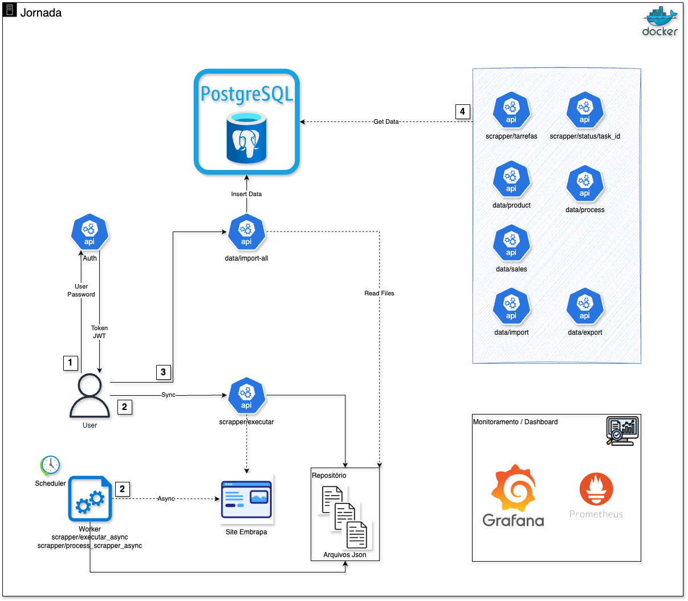

# **FIAP-Embrapa API**

API REST desenvolvida para o projeto de pós-graduação em integração com a Embrapa. Esta API permite acesso a dados vitivinicultura, com recursos de autenticação, web scraping e comunicação com serviços externos.

## **📋 Índice**

* [Descrição](#bookmark=id.oe2jzpb5qbg3)

* [Tecnologias Utilizadas](#bookmark=id.xga2xtr7cafo)

* [Arquitetura](#bookmark=id.8hgj00r6hsbl)

* [Requisitos](#bookmark=id.rfgs2zi2ilod)

* [Estrutura do Projeto](#bookmark=id.maqvfe1zp6k8)

* [Instalação e Execução](#bookmark=id.8v672bfzpsns)

* [Endpoints Disponíveis](#bookmark=id.szdafwvywnom)

* [Desenvolvimento](#bookmark=id.45tbmctoajb2)

* [Utilizando Podman](#bookmark=id.gk6wqaswcse)

* [Contribuição](#bookmark=id.b62jcia0r1n)

## **📝 Descrição**

Este projeto implementa uma API REST para coleta, processamento e disponibilização de dados relacionados a vitivinicultura da Embrapa. A aplicação possui funcionalidades de autenticação, acesso a banco de dados PostgreSQL, integração com APIs externas e capacidades de web scraping.

## **🔧 Tecnologias Utilizadas**

* **Backend**: Python 3.11 com FastAPI

* **Banco de Dados**: PostgreSQL 16.8

* **Connection Pooling**: PgBouncer

* **Migrations**: Liquibase

* **Containerização**: Docker/Podman e Docker Compose/Podman Compose

* **Documentação**: Swagger UI (integrado ao FastAPI)

## **🏗 Arquitetura**

A arquitetura do projeto segue os princípios de microserviços, com os seguintes componentes:

* **API Gateway**: Ponto de entrada para as requisições

* **Serviço de Autenticação**: Gerenciamento de usuários e autenticação

* **Serviço de Dados**: Acesso e manipulação dos dados da Embrapa

* **Web Scraping**: Coleta de dados de fontes externas

* **Banco de Dados**: Armazenamento persistente dos dados

## **📋 Requisitos**

* Docker e Docker Compose (ou Podman e Podman Compose como alternativas)

* Git

* Python 3.11+ (para desenvolvimento local)

## **📁 Estrutura do Projeto**

embrapa-api/  
├── .env                          \# Variáveis de ambiente  
├── .gitignore                    \# Arquivos a serem ignorados pelo git  
├── Dockerfile                    \# Configuração para build da imagem Docker  
├── docker-compose.yml            \# Configuração dos serviços  
├── README.md                     \# Este documento  
├── requirements.txt              \# Dependências Python  
├── migrations/                   \# Diretório para migrações do Liquibase  
│   ├── local/  
│   │   └── init.sql              \# Script SQL inicial para o banco de dados  
│   ├── changelog/                \# Arquivos de alteração do Liquibase  
│   │   └── db.changelog-master.xml  
│   └── liquibase.properties      \# Configurações do Liquibase  
└── src/                          \# Código fonte da aplicação  
    ├── \_\_init\_\_.py  
    ├── main.py                   \# Ponto de entrada da aplicação  
    ├── config/                   \# Configurações da aplicação  
    ├── api/                      \# Módulos da API  
    ├── core/                     \# Lógica de negócios  
    ├── db/                       \# Camada de acesso ao banco de dados  
    ├── scraper/                  \# Módulo de web scraping  
    ├── external/                 \# Integração com serviços externos  
    └── utils/                    \# Utilitários

### Desenho de Infraestrutura


**Containers do Projeto:**

- **embrapa-db**  
  Banco de dados PostgreSQL que armazena os dados da aplicação.

- **pgbouncer**  
  Proxy/pooler de conexões para o PostgreSQL, otimizando o acesso ao banco.

- **embrapa-migrations**  
  Executa migrações do banco de dados usando Liquibase ao iniciar o ambiente.

- **embrapa-api**  
  API principal da aplicação, desenvolvida em FastAPI, responsável por expor os endpoints REST.

- **prometheus**  
  Banco de métricas responsável por coletar e armazenar métricas dos serviços e exporters.  
  _Exemplos de métricas:_ uso de CPU/memória dos containers, conexões ao banco, latência de requisições, status dos serviços.

- **grafana**  
  Dashboard de visualização para métricas e logs, integrando-se ao Prometheus e Loki.

- **loki**  
  Banco centralizado de logs, utilizado para armazenar e indexar logs dos containers.  
  _Exemplos de logs:_ requisições HTTP da API, erros/exceções, logs de inicialização dos serviços, logs do banco de dados.

- **promtail**  
  Agente de coleta de logs dos containers, enviando-os para o Loki.

- **postgres_exporter**  
  Exportador de métricas do PostgreSQL para o Prometheus.  
  _Exemplos de métricas:_ conexões ativas, locks, tempo de execução de queries, espaço em disco utilizado.

- **pgbouncer_exporter**  
  Exportador de métricas do PgBouncer para o Prometheus.  
  _Exemplos de métricas:_ conexões no pool, conexões ativas/inativas, taxa de requisições.

- **node_exporter**  
  Exportador de métricas do host (CPU, memória, disco) para o Prometheus.  
  _Exemplos de métricas:_ uso de CPU do host, espaço em disco, uso de memória RAM.

- **container_monitor**  
  Exportador customizado de métricas de status, CPU e memória dos containers para o Prometheus.  
  _Exemplos de métricas:_ status dos containers (rodando/parado), uso de CPU por container, uso de memória por container.

### Desenho de Solução



**Jornada do Desenho:**
1. **Autenticação**
   - Para acessar os demais serviços da API, é necessário autenticar-se informando usuário e senha.
   - O endpoint `/auth` retorna um token JWT caso as credenciais estejam corretas.
   - Esse token deve ser utilizado nas próximas requisições para autorização.

2. **Coleta de Dados do Site Embrapa**
   - Após autenticação, é possível capturar os dados do site da Embrapa de duas formas:
     - **Assíncrona (Async):** Um worker executa a consulta no site e atualiza os arquivos JSON no projeto em background.
     - **Síncrona (Sync):** A consulta é feita diretamente via chamada de API, e os arquivos JSON são atualizados imediatamente.
   - Os dados coletados são armazenados em arquivos JSON dentro do projeto.

3. **Importação dos Dados para o Banco**
   - O endpoint `/import-all` é utilizado para importar os dados dos arquivos JSON gerados na etapa anterior para a base de dados.

4. **Consulta aos Dados**
   - A API disponibiliza endpoints para consultar os dados já carregados na base, permitindo acesso a diferentes módulos como produto, processamento, vendas, importação e exportação.


## **🚀 Instalação e Execução**

### **Usando Docker (Recomendado)**

1. Clone o repositório:

git clone https://github.com/rodrigodfernandes/embrapa-api.git  
cd embrapa-api

2. Configure as variáveis de ambiente:

cp .env.example .env  
*\# Edite o arquivo .env conforme necessário*

3. Inicie os serviços com Docker Compose:

docker-compose up \-d

4. Verifique se os serviços estão funcionando:

docker-compose ps

### **Desenvolvimento Local**

1. Prepare o ambiente virtual Python:

python \-m venv venv  
source venv/bin/activate  *\# No Windows use: venv\\Scripts\\activate*  
pip install \-r requirements.txt

2. Execute o banco de dados e serviços relacionados:

docker-compose up \-d embrapa-db pgbouncer embrapa-migrations

3. Execute a aplicação em modo de desenvolvimento:

uvicorn src.main:app \--reload \--host 0.0.0.0 \--port 8000

## **🐳 Utilizando Podman**

Se preferir utilizar Podman em vez de Docker, você pode utilizar os seguintes comandos:

### **Iniciando com Podman Compose**

*\# Instalar Podman e Podman Compose (Ubuntu/Debian)*  
sudo apt-get update  
sudo apt-get install \-y podman  
pip3 install podman-compose

*\# Iniciar serviços*  
podman-compose up \-d

*\# Verificar status*  
podman-compose ps

*\# Logs*  
podman-compose logs \-f

*\# Parar serviços*  
podman-compose down

### **Comandos Podman Individuais**

*\# Criar rede*  
podman network create embrapa-net

*\# Executar banco de dados*  
podman run \-d \--name embrapa-db \\  
  \--network embrapa-net \\  
  \-p 5432:5432 \\  
  \-e POSTGRES\_USER=postgres \\  
  \-e POSTGRES\_PASSWORD=postgres \\  
  \-e POSTGRES\_DB=fiap-embrapa \\  
  \-v ./migrations/local/init.sql:/docker-entrypoint-initdb.d/init.sql \\  
  postgres:16.8-alpine

*\# Executar PgBouncer*  
podman run \-d \--name pgbouncer \\  
  \--network embrapa-net \\  
  \-p 6432:6432 \\  
  \-e POSTGRESQL\_USERNAME=fiap-embrapa-app \\  
  \-e POSTGRESQL\_PASSWORD=fiap-embrapa-app \\  
  \-e POSTGRESQL\_DATABASE=fiap-embrapa \\  
  \-e PGBOUNCER\_DATABASE=fiap-embrapa \\  
  \-e PGBOUNCER\_POOL\_MODE=transaction \\  
  \-e PGBOUNCER\_IGNORE\_STARTUP\_PARAMETERS=extra\_float\_digits \\  
  \-e POSTGRESQL\_HOST=embrapa-db \\  
  bitnami/pgbouncer

*\# Executar aplicação*  
podman build \-t embrapa-api .  
podman run \-d \--name embrapa-api \\  
  \--network embrapa-net \\  
  \-p 8000:8000 \\  
  \-e DB\_HOST=pgbouncer \\  
  \-e DB\_PORT=6432 \\  
  \-e DB\_USER=fiap-embrapa-app \\  
  \-e DB\_PASSWORD=fiap-embrapa-app \\  
  \-e DB\_NAME=fiap-embrapa \\  
  \-v ./src:/app/src \\  
  embrapa-api

Para informações mais detalhadas sobre o uso do Podman, consulte o arquivo PODMAN\_GUIDE.md incluído neste projeto.

## **🔌 Endpoints Disponíveis**

A API possui os seguintes endpoints básicos:

* **Autenticação**: GET /api/auth \- Retorna o token da requisição após passar usuário e senha

* **Raiz da API**: GET / \- Retorna uma mensagem de boas-vindas

* **Verificação de Saúde**: GET /health \- Retorna o status da aplicação

* **Documentação Swagger**: GET /docs \- Interface interativa com a documentação da API

* **Documentação ReDoc**: GET /redoc \- Documentação alternativa da API

Quando implementados, os endpoints específicos da aplicação estarão disponíveis sob o prefixo /api.

### **Endpoints Futuros**

* **Dados Agrícolas**: /api/data/\* \- Acesso aos dados coletados

* **Análises**: /api/analysis/\* \- Endpoints para análises específicas

### **Endpoints Externos**

- **Swagger (Documentação):** [http://45.184.70.12:8000/docs](http://45.184.70.12:8000/docs)
- **API (Raiz):** [http://45.184.70.12:8000/](http://45.184.70.12:8000/)
- **Grafana:** [http://45.184.70.12:3000/](http://45.184.70.12:3000/)

## **💻 Desenvolvimento**

### **Autenticação**

**1.** Como adicionar na função
Para adicionar autenticação nas rotas criadas, basta adicionar **"current_user: str = Depends(get_current_user)"** na função que está dentro de endpoints, como no exemplo abaixo

```python
@router.get("/protected")
def protected(current_user: str = Depends(get_current_user)):
  return {"message": f"Olá, {current_user}. Você acessou uma rota protegida!"}
```

**2.** Como requisitar o token
* **2.1.** Chamar o endpoint de autenticação /api/auth passando usuário e senha, por fins de teste pode ser usado, eles são gravados critografados na base
 User: admin
 Password: mudar123

* **2.2.** A API de autenticação irá retornar um token, que deverá ser inserido na chamada da API que deseja utilizar, passando o token em Authorization / Bearer Token


### **Adicionando Novas Rotas**

Para adicionar novas rotas à API:

1. Crie um novo arquivo em src/api/endpoints/ para o recurso

2. Defina um router com os endpoints necessários

3. Importe e inclua o router em src/api/routes.py

Exemplo de um arquivo de endpoint src/api/endpoints/example.py:

**from** fastapi **import** APIRouter, HTTPException

router \= APIRouter()

@router.get("/")  
**async** **def** get\_examples():  
    **return** {"examples": \["example1", "example2"\]}

@router.get("/{example\_id}")  
**async** **def** get\_example(example\_id: int):  
    **if** example\_id \< 1:  
        **raise** HTTPException(status\_code\=404, detail\="Example not found")  
    **return** {"example\_id": example\_id, "name": f"Example {example\_id}"}

Então, em src/api/routes.py:

**from** fastapi **import** APIRouter  
**from** src.api.endpoints **import** example, auth, data

router \= APIRouter()

router.include\_router(example.router, prefix\="/examples", tags\=\["examples"\])  
router.include\_router(auth.router, prefix\="/auth", tags\=\["authentication"\])  
router.include\_router(data.router, prefix\="/data", tags\=\["data"\])

### **Banco de Dados**

O projeto utiliza PostgreSQL com connection pooling via PgBouncer. Para acessar o banco:

*\# Conectar diretamente ao PostgreSQL*  
docker-compose exec embrapa-db psql \-U postgres \-d fiap-embrapa

*\# Conectar via PgBouncer*  
docker-compose exec pgbouncer psql \-h localhost \-p 6432 \-U fiap-embrapa-app \-d fiap-embrapa

*\# Usando Podman*  
podman exec \-it embrapa-db psql \-U postgres \-d fiap-embrapa  
podman exec \-it pgbouncer psql \-h localhost \-p 6432 \-U fiap-embrapa-app \-d fiap-embrapa

## **👥 Contribuição**

Para contribuir com o projeto:

1. Faça um fork do repositório

2. Crie uma branch para sua feature (git checkout \-b feature/nova-funcionalidade)

3. Commit suas mudanças (git commit \-am 'Adiciona nova funcionalidade')

4. Push para a branch (git push origin feature/nova-funcionalidade)

5. Crie um Pull Request

---

Desenvolvido para o projeto de pós-graduação FIAP.
